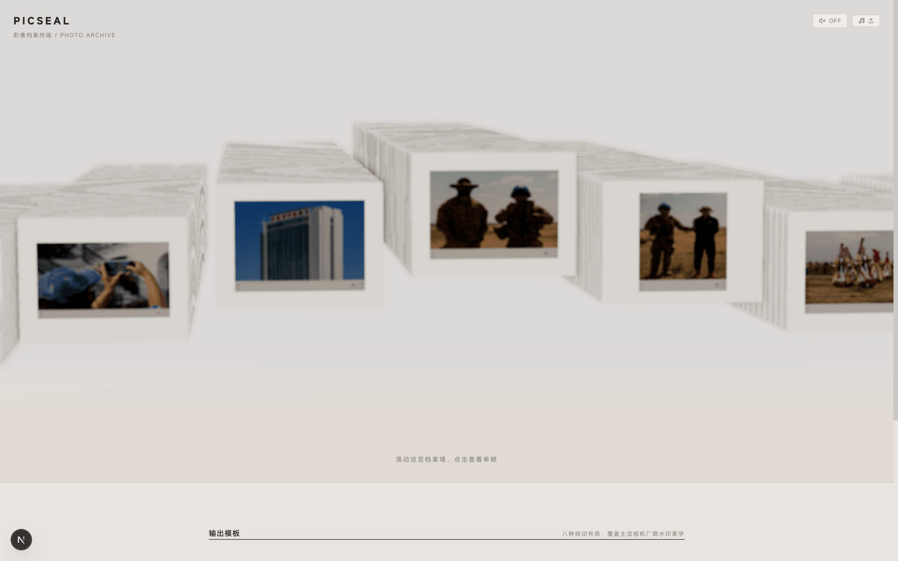
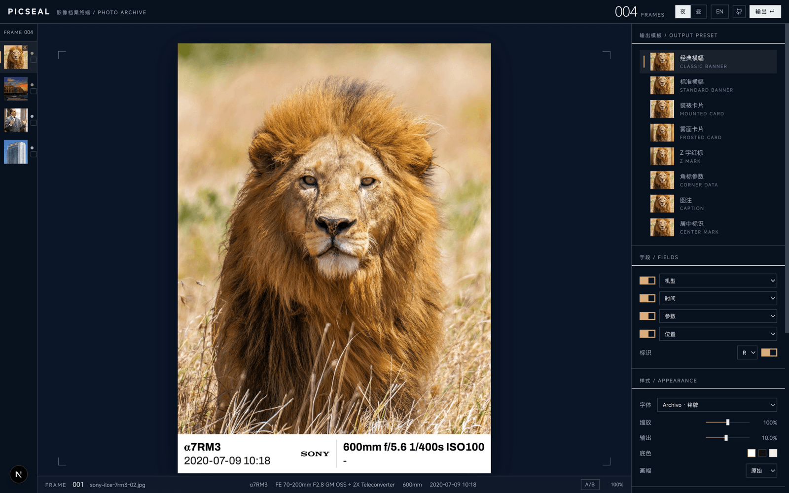

<div align="center">

# PICSEAL

**Photo Archive Terminal · 影像档案终端**

Camera-brand style photo watermarks, generated entirely in your browser.
相机品牌风格照片水印，完全在你的浏览器本地生成。

[](LICENSE)
[](https://nextjs.org/)
[](https://www.typescriptlang.org/)
[](#quick-start)
[](#deployment)

[简体中文](README.md) · **English**

</div>

---

PICSEAL adds camera-brand style info watermarks — body / lens / exposure params / date / brand logo — to your photos, following the official watermark aesthetics of Xiaomi·Leica, Nikon Z, Sony and others. Decoding, composition and export all happen locally in your browser. **Photos never leave your device.**

The pipeline: **Import → Tune → Lock → Batch → Deliver** — preview a single frame, lock the preset once you're happy, then produce the whole roll in one click and deliver as a ZIP.

## Preview

**Landing · 3D photo archive wall** — frosted-glass archive cases in a warm gallery, deep lanes with a long-lens compressed field of view; sample photos are upgraded in place after a real watermark render:



**Studio · single-frame tuning** — 8 live templates with automatic EXIF field fill:



## ✨ Features

- **8 built-in templates**: Classic Banner (Xiaomi·Leica) / Standard Banner / Mounted Card / Frosted Card / Z Mark / Corner Data / Caption / Center Mark. Layout metrics ported item-by-item from [semi-utils](https://github.com/leslievan/semi-utils)' `WatermarkFilter`: 12% bottom margin, 30% slot line-box height, 5% line gap, line-box alignment, right column hugs the divider, one shared font size per banner (auto shrink on overflow)
- **11 watermark font families**: Archivo (default) / Roboto / Alibaba PuHuiTi / MiSans / Bebas Neue / Oswald / Playfair Display / Noto Serif SC / LXGW WenKai / Smiley Sans / Ma Shan Zheng calligraphy, grouped by family with adjustable size
- **Batch pipeline**: drag / paste / folder / **ZIP archive** import → live preview + A/B compare → preset lock (localStorage / JSON import & export) → parallel worker pool → **streamed ZIP download** (compress while producing, File System Access direct write first)
- **Full EXIF preservation**: original capture metadata is written back on export across all output formats (JPEG / PNG / WebP), cross-format supported (HEIC original → JPEG output), Orientation reset on write to prevent double rotation
- **3D photo archive wall** (landing): warm gallery + frosted-glass archive cases (physical transmission materials) + instanced cover atlas + horizontal deep lanes + long-lens compressed FOV + SSAO / depth-of-field / SMAA post-processing. Interaction and motion deeply ported from [Rhine-Music-Demo](https://github.com/RonaldDeng/Rhine-Music-Demo) (MIT)
- **Beat-synced BGM**: WebAudio spectral-flux onset detection ripples the wall to the beat; ships with a CC0 track ([Komiku](https://commons.wikimedia.org/wiki/File:Komiku_-_03_-_The_road_we_use_to_travel_when_we_were_kids.ogg)), and you can load your own audio (stored locally in IndexedDB)
- **Dark & light themes · bilingual (zh/en) · PWA** · RhineLab terminal visual language (square corners / 1px rules / bilingual micro labels / 650ms color interpolation)
- **Local-first**: zero uploads, zero accounts, works offline; sample photos come from Wikimedia Commons under free licenses

## 🚀 Quick Start

```bash
pnpm install
pnpm dev        # http://localhost:3000
```

```bash
pnpm test       # Vitest suite
pnpm typecheck  # tsc --noEmit
pnpm build      # production build
```

> The bundled sample library is collected from Wikimedia Commons by `scripts/fetch-samples.mjs` (per-camera categories, EXIF validation, quality gates, proper attribution). The repo ships finished samples; to rebuild: `node scripts/fetch-samples.mjs --min 45`.

## 📋 Format Matrix

| Stage | Formats | Implementation |
|---|---|---|
| Input decode | JPEG / PNG / WebP / AVIF | browser native |
| | HEIC / HEIF | Safari native (broader support in progress) |
| Output encode | JPEG / PNG / WebP | Canvas native |
| EXIF read | JPEG / HEIF / WebP | [exifr](https://github.com/MikeKovarik/exifr) (batch pick fast path) |
| EXIF write | JPEG / PNG / WebP | [little_exif](https://github.com/TechnikTobi/little_exif) (Rust→WASM) |

## 🏗 Architecture

```
rust/exif-writer/        little_exif thin wrapper (wasm-bindgen, prebuilt artifacts committed)
src/core/                watermark engine (pure TS, zero DOM, covered by Vitest)
  exif/ brands/ render/ templates/ export/
src/three/wall/          3D archive wall (motion / camera / materials / atlas / scene)
src/three/audio/         beat engine (spectral-flux onset + bass envelope)
src/workers/             OffscreenCanvas render workers + thread pool
src/stores/              Zustand: photos / settings / queue
app/[locale]/            zh / en routes (landing / studio / about)
scripts/                 sample collection / WASM build
```

See [DESIGN.md](DESIGN.md) for the visual language and design tokens.

## ❓ FAQ

**Are batched photos still there after a refresh?** No — File handles die with the page and batches are not persisted; but your presets (template + output config) persist.

**Why are PNG exports large?** PNG is lossless; for social sharing prefer JPEG 92 or WebP.

**Can I use "Welcome Home, Son" as BGM?** It's a commercially licensed song and cannot ship with the repo. Use the upload button at the top-right of the landing page to load audio you own — it stays in your browser's IndexedDB.

## 🙏 Acknowledgements

This project stands on the shoulders of these excellent open-source projects — many thanks:

- **[semi-utils](https://github.com/leslievan/semi-utils)** — batch camera watermark tool. Every layout metric in PICSEAL's templates (margin ratios, the banner formula, the anchor system) is ported from its `WatermarkFilter`; brand logo assets and the Roboto font also come from that repo.
- **[Rhine-Music-Demo](https://github.com/RonaldDeng/Rhine-Music-Demo)** (MIT, © LBEILC / RonaldDeng, based on [RhineLabUI](https://github.com/LBEILC/RhineLabUI)) — the design and motion source of the landing page's 3D archive wall: frosted-glass archive cases, deep lanes, long-lens compressed FOV, critically-damped springs, wave-field displacement and the post-processing chain are all ported from its implementation.
- [little_exif](https://github.com/TechnikTobi/little_exif) (MIT/Apache) · [exifr](https://github.com/MikeKovarik/exifr) (MIT) · [fflate](https://github.com/101arrowz/fflate) (MIT) · [three.js](https://github.com/mrdoob/three.js) · [Next.js](https://nextjs.org/) · [Radix UI](https://www.radix-ui.com/) · [Tailwind CSS](https://tailwindcss.com/) · [Zustand](https://github.com/pmndrs/zustand) · [Zod](https://zod.dev/)
- Fonts: Archivo · Bebas Neue · Oswald · Playfair Display · Roboto · Noto Serif SC · LXGW WenKai · Smiley Sans · Ma Shan Zheng (all OFL), Alibaba PuHuiTi, MiSans (free commercial license, see `public/fonts/licenses/`)
- Bundled BGM: Komiku (CC0, see `public/audio/CREDITS.md`); sample photos from Wikimedia Commons (attribution in [CREDITS.md](CREDITS.md))

## 📄 License

[MIT](LICENSE) © Wang Zhiwei
